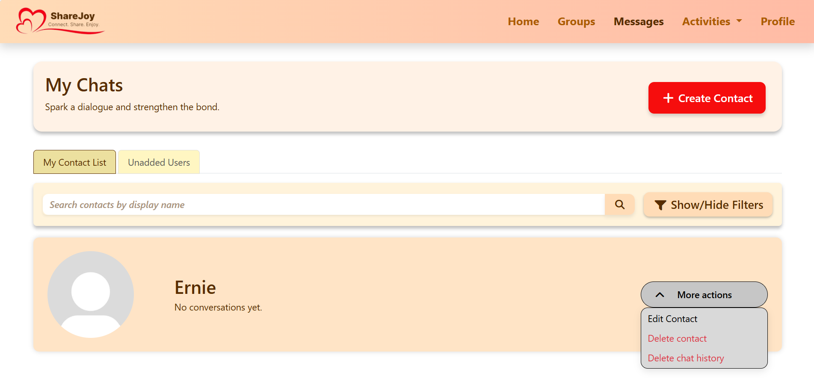
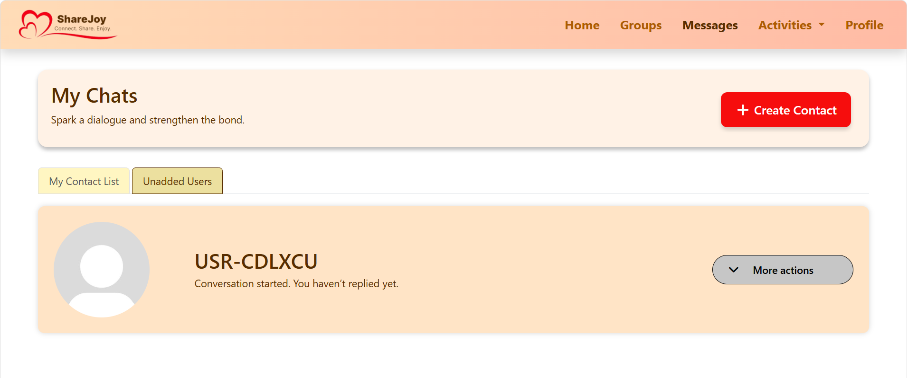
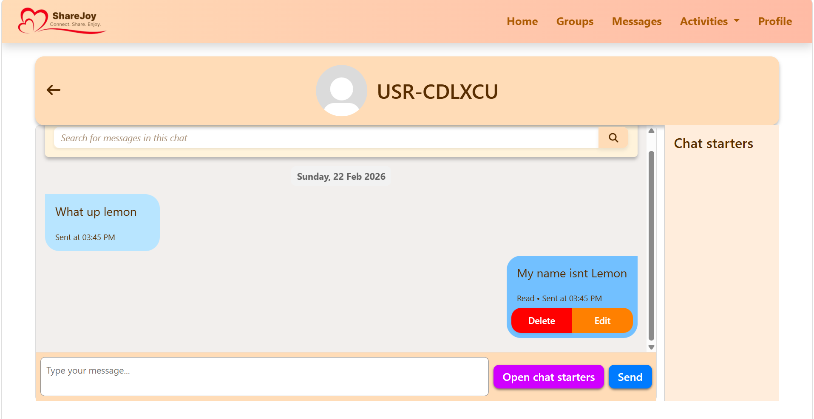
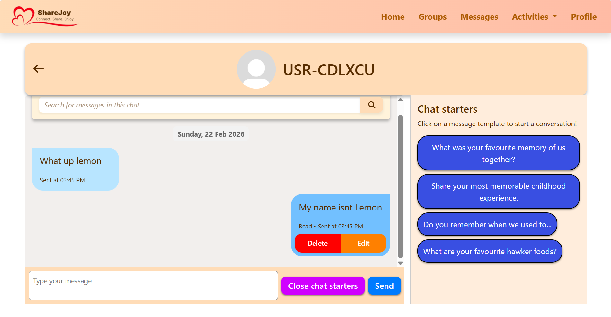

# ShareJoy
Flask‑based web application built for a Web Development module group project at Nanyang Polytechnic
It was designed to promote intergenerational communication.

## Flask App Messaging Section Preview

### Contact List 

### Unadded Users List

### Chat Interface

### Chat Starter Pane

## My Contributions
- Developed the Contact Creation Form
- Implemented the Contact Management System
- Developed the Messaging System
- Built the Conversation Starter Pane
- Improved responsiveness across devices

## Technologies
- Python
- Flask
- SQLAlchemy
- HTML
- CSS
- Bootstrap
- JavaScript

## Project Type
Academic Group Project

> This repository showcases my individual contributions to the project. Features developed by other team members are not listed above.
